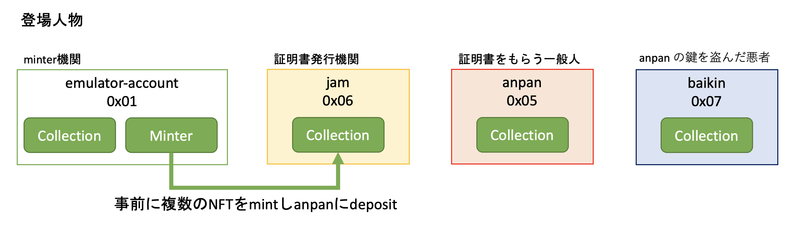
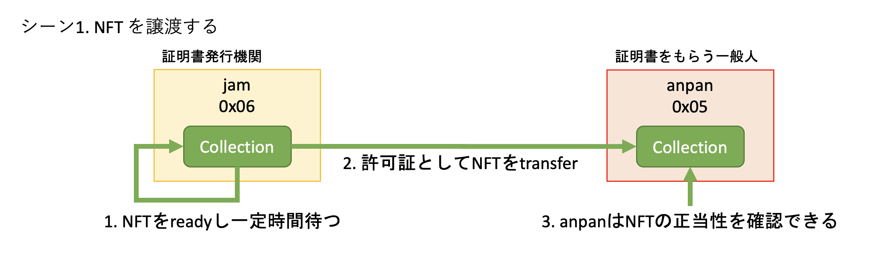
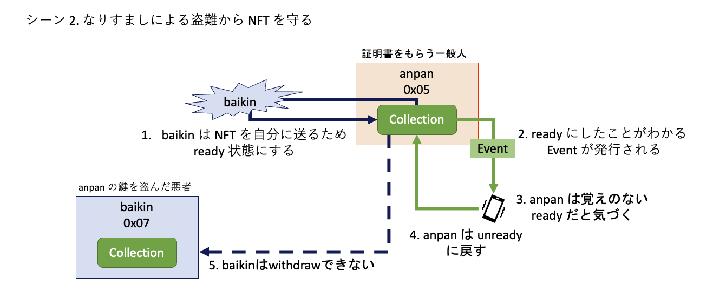
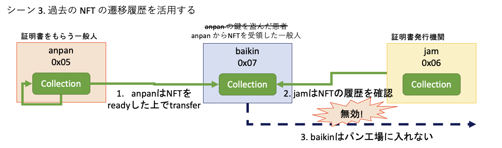

# tokyo_web3_hackathon_2022

tokyo web3 hackathon のために開発したコントラクト。

| 項目名                           | 内容                                                                          |
| -------------------------------- | ----------------------------------------------------------------------------- |
| 使用した tech stacks             | cadence                                                                       |
| 使用した Blockchain              | flow                                                                          |
| deploy した Contract             | `src/contracts/StrictNFT.cdc`                                                 |
| application code やその他の file | トランザクションコード: `src/transactions/`, スクリプトコード: `src/scripts/` |
| テスト手順                       | README.md 後半                                                                |

# プロジェクトの概要

StrictNFT とは SBT の基本的な考え方を踏襲しつつ、より柔軟に利用でき、かつセキュリティも保つことができる NFT です。SBT と同じくアイデンティティや権利/正当性の証明としての利用を想定していますが「譲渡可能」という点が異なります。
SBT は譲渡できないため、証明を発行する機関が mint する必要があり、両者を分離できません。一方で StrictNFT は履歴（譲渡回数、過去のアドレス）を NFT に記録した上で譲渡できるため、証明を発行する機関と mint する機関を分離でき、また履歴を見ることで正当なルートであることを保証できます。
SBT は Burn はできるためユーザーが鍵を盗まれると NFT を一気に失う可能性があります。StrictNFT では譲渡と Burn をするには NFT を ready 状態にして一定時間待つタイムロック機能を持っています。ready 状態になるときに Event が発火するため、所有者の知らぬところで鍵を盗んだユーザーが ready 状態にしても所有者は気付くことができます。
このように、履歴によって NFT の信頼担保につながり、タイムロックによって鍵の盗難対策ができる NFT となっています。

# コンセプト

- セキュアで柔軟な SBT Like な NFT を Flow/Cadence で作る

- SBT は

  - 譲渡できない
  - 鍵盗難対策
    - 移動できないから安全
    - ソーシャルリカバリーで鍵を再設定できる
  - 鍵紛失対策
    - ソーシャルリカバリーで鍵を再設定できる
      - 4 of 7 が推奨されている
  - 参考：[Why we need wide adoption of social recovery wallets](https://vitalik.ca/general/2021/01/11/recovery.html)

- StrictNFT は

  - 譲渡できる
    - ただし、すぐには譲渡できない
      - NFT を ready 状態にして、所定の時間待つ（Ready Event が発火される）
      - その後、withdraw が可能になる
  - 鍵盗難対策
    - 譲渡するためには ready 状態にする必要があるが、その際に Ready Event が発火されるため、ユーザーが気づける可能性が高い（DApps やウォレットの仕様次第）
    - 実行した覚えのない Ready Event が発生したら、すぐに unready に戻し、鍵の再設定を実施することで、被害を抑えられる
      - 盗難時に ready 状態にしていた NFT は流出を防げない
  - 鍵紛失対策
    - ソーシャルリカバリーで鍵を再設定できる
      - 自分の別端末を含めた 2 of 3 くらいの最小構成でも十分堅牢
        - (7 人集めることにハードルの高さを感じる)

# StrictNFT の特徴

## 基本的には SBT の利用想定と同じ

- 免許証、パスポート
- 職務履歴証明、学歴証明
- 医療記録の証明
- NFT との紐付けによる正当性の証明（アーティストなど）
  - NFT として作品を発行するときに SBT をつける

## 譲渡履歴の記録

- withdraw/deposit の回数、deposit を実行したアカウントのアドレスがコントラクトに記録される

## タイムロック

- withdraw と destroy を実行するには事前に対象の NFT を ready 状態にしておき、一定時間待つ必要があるという仕組み
- 例えば、悪意あるユーザーが一般ユーザーの鍵を盗み、不正に withdraw や destroy を実行しようとするときに、一度 NFT を ready 状態にする必要がある
- ready 状態になると Event が発火されるようにしているため、一般ユーザーはその行動を検知できる
- 一般ユーザーは自分が実行したトランザクションではない場合、すぐにその NFT を unready の状態に戻すことで、悪意あるユーザーの withdraw や destroy を防ぐことが可能

# ローカル環境構築手順

FlowCLI はインストールされている前提。

## 最速セットアップ方法

```sh
rm -rf flowdb/ flow.json
flow init
flow emulator --persist --contracts --simple-addresses -v
```

別ターミナルで下記を実行

```sh
bash setup_env.sh
flow deploy
flow transactions send --signer emulator-account src/transactions/mint_nft.cdc 0x01
flow transactions send src/transactions/get_info.cdc
flow transactions send --signer emulator-account src/transactions/get_nft_info.cdc 0
```

## FlowCLI の初期化

```sh
flow init
```

## エミュレーターの起動

```sh
flow emulator --persist --contracts --simple-addresses -v
```

`--persist` でエミュレータのデータを永続化させている。上記コマンドを実行した時のカレントディレクトリに `flowdb` というフォルダが生成され、そこにファイルが格納される。

`--contracts` でデフォルトのコントラクトがデプロイされた状態でエミュレータが起動される。デプロイされるコントラクトはログに出力される。

```
INFO[0000] 📜  Flow contract                              FlowServiceAccount=0x0000000000000001
INFO[0000] 📜  Flow contract                              FlowToken=0x0000000000000003
INFO[0000] 📜  Flow contract                              FungibleToken=0x0000000000000002
INFO[0000] 📜  Flow contract                              FlowFees=0x0000000000000004
INFO[0000] 📜  Flow contract                              FlowStorageFees=0x0000000000000001
INFO[0000] 💵  FUSD contract                              FUSD=0x0000000000000001
INFO[0000] ✨  NFT contract                               NonFungibleToken=0x0000000000000001
INFO[0000] ✨  Metadata views contract                    MetadataViews=0x0000000000000001
INFO[0000] ✨  Example NFT contract                       ExampleNFT=0x0000000000000001
INFO[0000] ✨   NFT Storefront contract v2                NFTStorefrontV2=0x0000000000000001
INFO[0000] ✨   NFT Storefront contract                   NFTStorefront=0x0000000000000001
```

`--simple-addresses` でシンプルなアドレス形態にできる。

`-v` でログを詳細に出力してくれる（log()の結果も出力してくれるようになる）。

※ 環境をリセットしたいときは、`flowdb`フォルダを削除する。

## アカウントと flow.json のセットアップ

以下を実行するシェルは `setup_env.sh`。

### flow.json の更新

シンプルなアドレス形態を使う形で起動したため、`flow init`で自動生成された`flow.json`を書き換える。

変更前

```json
  "accounts": {
    "emulator-account": {
      "address": "f8d6e0586b0a20c7",
      "key": "XXXXXXXXXXXXXXXXXXXXXXXXXXXXXXX"
    }
  }
```

変更後

```json
  "accounts": {
    "emulator-account": {
		 "address": "0x01",
      "key": "XXXXXXXXXXXXXXXXXXXXXXXXXXXXXXX"
    }
  }
```

### アカウントを作る

アカウントを３つ作る。

1. 鍵を作る

```sh
flow keys generate
```

`Private Key`と`Public Key`をメモっておく。

2. アカウントを作る

表示された `Public Key` を使ってアカウントを作る。

```sh
flow accounts create --key <上記コマンドで表示されたPublic Key>
```

成功するとアドレスが表示される。

```
Transaction ID: eafaf43703e68e149a49996ddd5a30c1bc0605fe067df7f1a34801e922f910ba

Address  0x0000000000000005
Balance  0.00100000
Keys     1

（省略）
```

3. flow.json にアカウントの情報を追加する

`address`部分には上記で表示された`Address`を記載する。`key`部分には`flow keys generate`を実行したときに表示された`Private Key`を記載する。

3 つのアカウントを作成すると flow.json は以下のようになる。

```json
{
  "networks": {
    "emulator": "127.0.0.1:3569",
    "mainnet": "access.mainnet.nodes.onflow.org:9000",
    "testnet": "access.devnet.nodes.onflow.org:9000"
  },
  "accounts": {
    "emulator-account": {
      "address": "0x01",
      "key": "XXXXXXXXXXXXXXXXXXXXXXXXXXXXXXX"
    },
    "anpan": {
      "address": "0x05",
      "key": "XXXXXXXXXXXXXXXXXXXXXXXXXXXXXXX"
    },
    "jam": {
      "address": "0x06",
      "key": "XXXXXXXXXXXXXXXXXXXXXXXXXXXXXXX"
    },
    "baikin": {
      "address": "0x07",
      "key": "XXXXXXXXXXXXXXXXXXXXXXXXXXXXXXX"
    }
  }
}
```

### コントラクトをデプロイする

flow.json に deployments と contracts の情報を追記する。

```json
{
	"networks": {
    (省略)
  },
	"accounts": {
    (省略)
  },
  "deployments": {
    "emulator": {
        "emulator-account": ["StrictNFT"]
    }
  },
  "contracts": {
    "StrictNFT": "./src/contracts/StrictNFT.cdc"
  }
}
```

デプロイする。

```
flow deploy
```

# 利用シーン

## 登場人物

- emulator-account(`0x01`): StrictNFT.cdc をデプロイするアカウント（minter リソースも所持）
- anpan(`0x05`): StrictNFT を使った証明書をもらう一般人
- jam(`0x06`): 証明書の発行機関
- baikin(`0x07`): anpan の鍵を盗んだ悪者



## 事前準備

- 上述した環境構築が完了している前提

- 各登場人物用にコレクションを作る

```
flow transactions send --signer anpan src/transactions/create_collection.cdc
flow transactions send --signer jam src/transactions/create_collection.cdc
flow transactions send --signer baikin src/transactions/create_collection.cdc
```

- emulator-account が複数の NFT を mint し 証明書の発行機関である jam に渡しておく
  - その際、ready してから withdraw や destroy が可能になるまでのロック時間（`readyTimeHourPeriod`）は 60 秒に設定する
  - 本来は 1 時間以上を設定することが望ましいが、テストのために短くしている

```
flow transactions send --signer emulator-account src/transactions/mint_nft.cdc 0x06
flow transactions send --signer emulator-account src/transactions/mint_nft.cdc 0x06
flow transactions send --signer emulator-account src/transactions/mint_nft.cdc 0x06
flow transactions send --signer emulator-account src/transactions/mint_nft.cdc 0x06
flow transactions send --signer emulator-account src/transactions/mint_nft.cdc 0x06
```

## シーン 1. NFT を譲渡する

まずは一般的な利用想定として、何かの証明書として NFT を利用する場面で、その証明書を発行するシーン。



1. anpan が証明書を付与する基準を満たしていると jam が判断し、 anpan に付与する予定の ID:0 の NFT を ready にする

```
flow transactions send --signer jam src/transactions/ready_nft.cdc 0
```

2. ロック時間が経過した後に、jam から anpan に証明書として ID:0 の NFT を渡す

```
flow transactions send --signer jam src/transactions/transfer_nft.cdc 0x05 0
```

3. anpan は`addressList`から、受領した NFT が正当なものか（正当な機関を通ってきたか）を確認できる

```
flow scripts execute src/scripts/get_nft_view.cdc 0x05 0
```

想定出力：

```
(省略), addressList: [[1667660770, 0x0000000000000001], [1667661880, 0x0000000000000006]], (省略)
```

## シーン 2. なりすましによる盗難から NFT を守る

anpan の秘密鍵を baikin が盗み、悪事を働こうとするシーン。



1. baikin は ID:0 の NFT を baikin に送るために、ready 状態にする

baikin は anpan の秘密鍵を持っているため `--signer anpan`を実行できる。

```
flow transactions send --signer anpan src/transactions/ready_nft.cdc 0
```

2. ready にしたことがわかる Event が発行される

Event ログの例

```
EVT [22849d] A.0000000000000001.StrictNFT.Ready: 0x90bab0fea7008bd3c12ce01ef67b63274d995d7dd42e883a8d71a5600fe26025
```

3. anpan は、自分のコレクションに関する Event が発生すると通知してくれる DApps を使っているため、ID:0 の NFT が ready 状態になったことに気づく

4. anpan はすぐさま ID:0 の NFT を unready 状態に変更する

```
flow transactions send --signer anpan src/transactions/unready_nft.cdc 0
```

5. baikin は ID:0 の NFT が unready になり、withdraw も destroy もできない

- withdraw する

```
flow transactions send --signer anpan src/transactions/transfer_nft.cdc 0x07 0
```

- NFT を destroy する

```
flow transactions send --signer anpan src/transactions/destroy_nft.cdc 0
```

- Collection を destroy する

```
flow transactions send --signer anpan src/transactions/destroy_collection.cdc
```

## シーン 3. 過去の NFT の遷移履歴を活用する

jam の知らないところで、anpan が baikin に証明書を渡してしまうシーン。



1. anpan は ID:0 の NFT を baikin に譲渡する

```
flow transactions send --signer anpan src/transactions/ready_nft.cdc 0
(待つ)
flow transactions send --signer anpan src/transactions/transfer_nft.cdc 0x07 0
```

2. baikin が ID:0 の NFT を証明に現実世界で何かをしようとした時（例えばパン工場に入る許可を取ろうとした時）に、jam が NFT を確認する

```
flow scripts execute src/scripts/get_nft_view.cdc 0x07 0
```

jam は証明書の`addressList`を確認し、経路が通常とは異なることを確認。NFT を無効とし、baikin の NFT では証明にならない旨を告げる…。

# テストケース

## 前提

- minter: minter 所有者
- user: StrictNFT リソース所有者
- any: StrictNFT リソース非所有者

## コントラクト

- `StrictNFT.cdc`をデプロイする

  `flow deploy`

## コレクション

- コレクションを作る

  anpan, jam, baikin のアカウントに作る

  ```
  flow transactions send --signer anpan src/transactions/create_collection.cdc
  flow transactions send --signer jam src/transactions/create_collection.cdc
  flow transactions send --signer baikin src/transactions/create_collection.cdc
  ```

- コレクションを破壊する

  コレクションを破壊するには、所持している NFT を全て ready にした上で、readyTimeHourPeriod が経過している状態にしておく必要がある

  逆に１つでも ready になっていない NFT がある、もしくは readyTimeHourPeriod が経過していない NFT があれば、破壊できない

  以下は baikin のコレクションを破壊する例

  ```
  flow transactions send --signer baikin src/transactions/destroy_collection.cdc
  flow transactions send --signer baikin src/transactions/get_info.cdc
  ```

## トークン

### コントラクト所有者 関連

- emulator-account が minter を所有時に mint する

  `mint_nft.cdc`では `initReadyTimeHourPeriod`を 60 秒に設定している

  ```
  flow transactions send --signer emulator-account src/transactions/mint_nft.cdc 0x01
  ```

- emulator-account が minter を所有していないときに mint できない

  emulator-account から minter を移動した上で mint してみることで確認できる

  以下は anpan に minter を移動するときの例

  - emulator-account から minter を移動

    ```
    flow transactions build src/transactions/move_minter.cdc \
    --proposer emulator-account \
    --payer emulator-account \
    --authorizer emulator-account \
    --authorizer anpan \
    --filter payload --save move_minter_tx

    flow transactions sign move_minter_tx --signer anpan --filter payload --save move_minter_tx
    flow transactions sign move_minter_tx --signer emulator-account --filter payload --save move_minter_tx

    flow transactions send-signed move_minter_tx
    ```

  - emulator-account による mint の実行
    ```
    flow transactions send --signer emulator-account src/transactions/mint_nft.cdc 0x01
    ```

- コントラクト所有者であっても関数の実行や変数の更新ができない

  ```
  flow transactions send --signer emulator-account src/transactions/cannot_get_nft_info.cdc 0
  ```

### minter 所有者 関連

- minter 所有者が mint する

  上記の minter の anpan への移動を実施した上で以下を実施することで、emulator-account 以外でも mint できることを確認できる

  ```
  flow transactions send --signer anpan src/transactions/mint_nft.cdc 0x05
  ```

- user は mint できない

  以下は jam が mint しようとする例。minter を持っていない前提

  ```
  flow transactions send --signer jam src/transactions/mint_nft.cdc 0x06
  ```

### コレクション所有者 関連

- initReadyTimeHourPeriod を 1 以上に設定できる

  以下は anpan が minter を持っている前提

  ```
  flow transactions send --signer anpan src/transactions/mint_nft.cdc 0x05
  ```

- initReadyTimeHourPeriod を 1 未満に設定できない

  以下は anpan が minter を持っている前提

  ```
  flow transactions send --signer anpan src/transactions/cannot_mint_nft.cdc 0x05
  ```

- user が別の user に deposit できる

  anpan が mint し、jam に deposit する例

  ```
  flow transactions send --signer anpan src/transactions/mint_nft.cdc 0x06
  ```

- user が自分のリソースを ready できる

  anpan が ID:1 の StrictNFT を所有している前提

  ```sh
  flow transactions send --signer anpan src/transactions/ready_nft.cdc 2
  flow transactions send --signer anpan src/transactions/get_nft_info.cdc 2
  ```

- user が指定した時間がたった NFT を withdraw できる

  上記の ready した瞬間から initReadyTimeHourPeriod に設定した時間が経過した前提

  以下は anpan から jam に transfer する例

  ```sh
  flow transactions send --signer anpan src/transactions/transfer_nft.cdc 0x06 2
  flow transactions send --signer jam src/transactions/get_nft_info.cdc 2
  ```

- user が withdraw した後の NFT が ready が false かつ readyTime が nil になっている

  ```
  flow transactions send --signer jam src/transactions/get_nft_info.cdc 2
  ```

- user が ready=false の NFT を withdraw できない

  ```
  flow transactions send --signer jam src/transactions/transfer_nft.cdc 0x01 2
  ```

- user が指定した時間がたっていない ready 状態の NFT を withdraw できない

  ```
  flow transactions send --signer jam src/transactions/ready_withdraw_nft.cdc 2
  ```

- user が指定した時間が経過した NFT を destroy できるか

  ```sh
  flow transactions send --signer jam src/transactions/ready_nft.cdc 2
  (60秒 待つ)
  flow transactions send --signer jam src/transactions/destroy_nft.cdc 2
  flow transactions send --signer jam src/transactions/get_nft_info.cdc 2
  ```

- user が指定した時間がたっていない NFT を destroy できない

  ```
  flow transactions send --signer emulator-account src/transactions/ready_destroy_nft.cdc 0
  ```

- user が ready 状態の NFT を unready できる

  ```
  flow transactions send --signer emulator-account src/transactions/get_nft_info.cdc 0
  flow transactions send --signer emulator-account src/transactions/ready_nft.cdc 0

  flow transactions send --signer emulator-account src/transactions/get_nft_info.cdc 0
  flow transactions send --signer emulator-account src/transactions/unready_nft.cdc 0

  flow transactions send --signer emulator-account src/transactions/get_nft_info.cdc 0
  ```

### 情報確認 関連

- withdraw と deposit の回数、アドレスと時刻が記録されている

  ```
  flow transactions send --signer emulator-account src/transactions/get_nft_info.cdc 0
  ```

- アドレスが 5 つ以下になっているか、FIFO になっている

  ```sh
  flow transactions send --signer anpan src/transactions/mint_nft_period_1.cdc 0x01

  flow transactions send --signer emulator-account src/transactions/ready_nft.cdc 5
  flow transactions send --signer emulator-account src/transactions/transfer_nft.cdc 0x05 5
  flow transactions send --signer anpan src/transactions/ready_nft.cdc 5
  flow transactions send --signer anpan src/transactions/transfer_nft.cdc 0x06 5
  flow transactions send --signer jam src/transactions/ready_nft.cdc 5
  flow transactions send --signer jam src/transactions/transfer_nft.cdc 0x01 5
  flow transactions send --signer emulator-account src/transactions/ready_nft.cdc 5
  flow transactions send --signer emulator-account src/transactions/transfer_nft.cdc 0x05 5
  flow transactions send --signer anpan src/transactions/ready_nft.cdc 5
  flow transactions send --signer anpan src/transactions/transfer_nft.cdc 0x06 5

  flow transactions send --signer jam src/transactions/get_nft_info.cdc 5
  ```

- Ready の Event が発火される

  ```
  flow transactions send --signer jam src/transactions/ready_nft.cdc 5
  ```

- Unready の Event が発火される

  ```
  flow transactions send --signer jam src/transactions/unready_nft.cdc 5
  ```

- any が withdrawCount, depositCount, addressList, readyTimeHourPeriod を確認できる

  ```
  flow scripts execute src/scripts/get_nft_view.cdc 0x01 0
  ```
